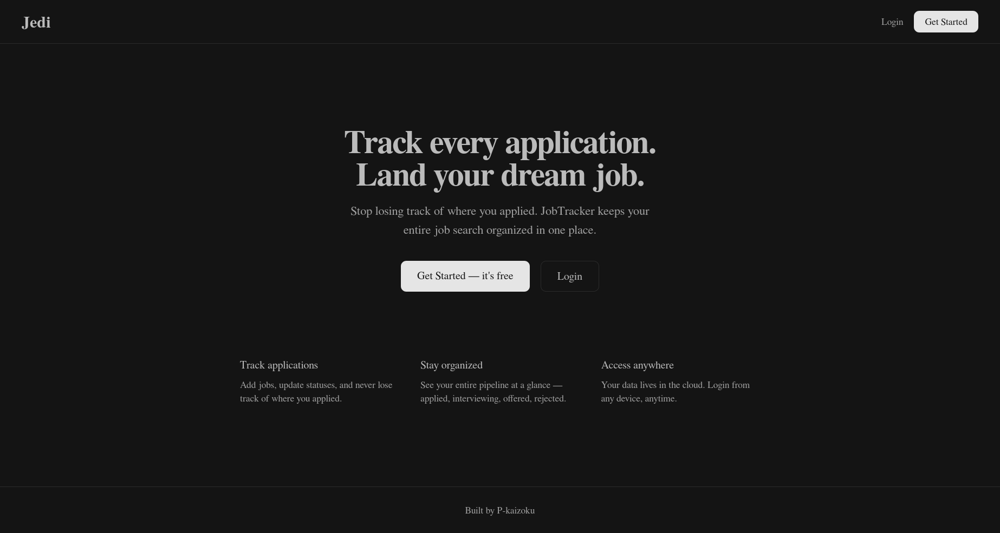
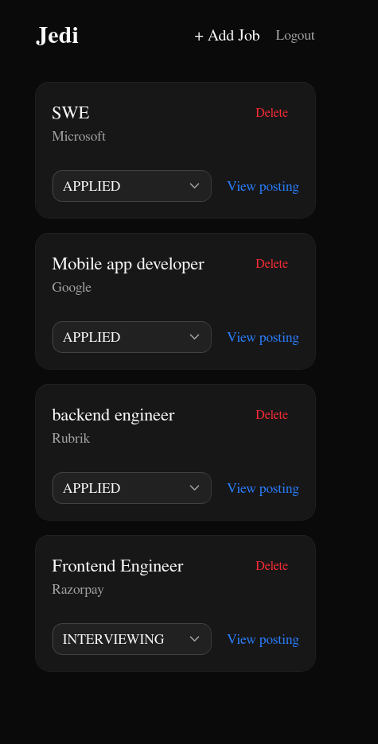

# Jedi — Job Application Tracker

> Track every application. Land your dream job.

A full-stack job application tracker built with Next.js, PostgreSQL, and Prisma. Keep your entire job search organized in one place — add applications, update statuses, and never lose track of where you applied.




## Features

- **Authentication** — Register, login, and logout with JWT-based auth
- **Track applications** — Add jobs with title, company, and posting URL
- **Update statuses** — Applied → Interviewing → Offered → Rejected
- **Protected routes** — Every request is authenticated server-side
- **Cloud database** — Your data persists across devices and sessions

## Tech Stack

| Layer      | Technology                                      |
| ---------- | ----------------------------------------------- |
| Frontend   | Next.js 16, TypeScript, Tailwind CSS, shadcn/ui |
| Backend    | Next.js API Routes                              |
| Database   | PostgreSQL (Prisma hosted)                      |
| ORM        | Prisma 7                                        |
| Auth       | JWT + bcrypt                                    |
| Deployment | Vercel                                          |

## Getting Started

### Prerequisites

- Node.js 18+
- A Prisma hosted database (free at [prisma.io](https://prisma.io))

### Installation

```bash
# Clone the repo
git clone https://github.com/P-kaizoku/jedi.git
cd jedi

# Install dependencies
npm install

# Set up environment variables
cp .env.example .env
# Add your DATABASE_URL and JWT_SECRET to .env

# Run migrations
npx prisma migrate dev --name init

# Start the dev server
npm run dev
```

Open [http://localhost:3000](http://localhost:3000).

### Environment Variables

```env
DATABASE_URL=your_prisma_postgres_connection_string
JWT_SECRET=your_random_secret_key
```

## API Routes

```
POST   /api/auth/register   Create a new account
POST   /api/auth/login      Login and receive JWT token
GET    /api/jobs            Get all jobs for authenticated user
POST   /api/jobs            Create a new job application
PATCH  /api/jobs/:id        Update job status
DELETE /api/jobs/:id        Delete a job application
```

## Project Structure

```
jedi/
├── app/
│   ├── api/
│   │   ├── auth/
│   │   │   ├── login/route.ts
│   │   │   └── register/route.ts
│   │   └── jobs/
│   │       ├── route.ts
│   │       └── [id]/route.ts
│   ├── dashboard/page.tsx
│   ├── login/page.tsx
│   ├── register/page.tsx
│   └── page.tsx
├── lib/
│   ├── prisma.ts
│   └── auth.ts
└── prisma/
    └── schema.prisma
```

## License

MIT
